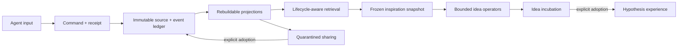

# Experience Hub

[](https://github.com/xwj123456/experience-hub/actions/workflows/ci.yml)
[](LICENSE)
[](https://www.python.org/)
[](https://github.com/xwj123456/experience-hub/releases)
[](https://github.com/xwj123456/experience-hub/stargazers)

**Local-first, deterministic infrastructure for auditable agent memory, lifecycle-aware retrieval, safe knowledge sharing, and evidence-grounded inspiration.**

Experience Hub gives AI agents a memory layer that can cool, blur, reactivate, propagate, and inspire without silently rewriting history. It runs locally on SQLite, exposes FastAPI and CLI interfaces, and keeps every durable state transition traceable and replayable.

> Status: `v0.1.0` local MVP. The core contracts are implemented and extensively tested. Production authentication and open-world intelligence evaluation remain intentionally out of scope.

## Why Experience Hub?

Most agent-memory systems optimize for storing and retrieving text. Experience Hub focuses on the harder operational questions:

- What should remain hot, cool down, or become difficult to recall?
- Can a strong cue reactivate cold memory without exposing it to weak queries?
- How can agents exchange experience without silently trusting or adopting it?
- Can new ideas remain proposals until evidence or an explicit decision promotes them?
- Can every decision be reconstructed after a crash, retry, or projection rebuild?

## What is implemented

- **Memory lifecycle** — hot, warm, cold, and archived states with deterministic decay, hysteresis, pinning, confirmation, refutation, restoration, and cue-driven reactivation.
- **Lifecycle-aware retrieval** — focused and associative retrieval, Chinese and English tokenization, bounded content expansion, blurred cold results, stable ranking, and explicit access effects.
- **Auditable history** — immutable experience versions, canonical content hashes, causation receipts, append-only domain events, and rebuildable projections.
- **Safe knowledge sharing** — topics, subscriptions, provenance chains, hop limits, quarantine inboxes, explicit adoption/rejection, retraction, feedback, and observer-relative trust.
- **Evidence-grounded inspiration** — frozen evidence snapshots, causal-gap, counterfactual, and distant-analogy operators, schema validation, deduplication, incubation, evaluation, and explicit adoption as a hypothesis.
- **Reliable local operation** — SQLite authority, Alembic migrations, idempotency, interrupted-run recovery, maintenance validation, FastAPI, and Typer CLI.

## Architecture



The implementation is a modular Python monolith. SQLite is authoritative; large bodies and snapshots remain in immutable source tables, while ordered events explain every durable domain transition. Projections can be verified or rebuilt from those sources.

## Setup

Requirements:

- Python 3.12
- [uv](https://docs.astral.sh/uv/)

```bash
git clone https://github.com/xwj123456/experience-hub.git
cd experience-hub
uv sync --all-groups --frozen
uv run experience-hub demo --reset
uv run experience-hub benchmark
```

Both commands run offline and return canonical JSON. A successful demo reports `all_invariants_hold: true`. A successful benchmark reports `passed: true` with an empty `failed_gates` list.

The current committed benchmark verifies:

| Gate | Required | Verified result |
|---|---:|---:|
| Focused macro recall@5 | `>= 0.90` | `1.00` |
| Cold-cue macro recall@5 | `>= 0.85` | `1.00` |
| Cold recall gain over hot/warm baseline | `>= 0.25` | `1.00` |
| Distractor false reactivations | `0` | `0` |
| Pending quarantine leakage | `0` | `0` |
| Adopted provenance completeness | `1.00` | `1.00` |
| Valid evidence-grounded ideas | `>= 12` | `28` |
| Idea schema and evidence validity | `1.00` | `1.00` |
| Unique mechanism ratio | `>= 0.70` | `0.8214` |
| Same-snapshot false incubation promotion | `0` | `0` |
| Byte-identical full replay | `true` | `true` |

These results are deterministic regression evidence on committed fixtures. They are not claims of consciousness, universal creativity, or correctness on arbitrary real-world data.

## Run the API

```bash
uv run experience-hub serve \
  --host 127.0.0.1 \
  --port 8000 \
  --database .data/experience_hub.db
```

Then open:

- Health: <http://127.0.0.1:8000/health>
- Swagger UI: <http://127.0.0.1:8000/docs>
- ReDoc: <http://127.0.0.1:8000/redoc>

The current API has no production authentication layer. Bind to localhost and do not expose it directly to an untrusted network.

## Core API surface

| Area | Representative operations |
|---|---|
| Agents | create and list owners |
| Experiences | create, version, retrieve, search, confirm, refute, pin, restore |
| Lifecycle | run deterministic evaluation cycles |
| Sharing | publish, subscribe, inspect quarantine, adopt, reject, retract, provide feedback |
| Inspiration | run bounded generators, list ideas, evaluate, adopt, reject, archive |

All state-changing HTTP commands require a unique `Idempotency-Key`. Retrying the same canonical request replays the stored response byte-for-byte; reusing the key for another request returns a conflict.

## Inspiration safety boundary

An idea is deliberately separate from memory:

1. Retrieval freezes a bounded, immutable evidence snapshot.
2. Enabled operators generate typed proposal branches outside database transactions.
3. References and schemas are validated, and near-duplicates are clustered.
4. Recurrence and evaluations can mature a mechanism, but do not make it true.
5. Only an explicit owner action can adopt an idea as a `hypothesis` experience.

The optional OpenAI-compatible generator is explicit opt-in, has bounded token and time budgets, cannot call tools, cannot write business state, and is disabled by default.

## Development

```bash
uv sync --all-groups --frozen
uv run pytest -q
uv run ruff check .
uv run mypy src
git diff --check
```

The full suite contains more than 2,000 tests and uses injected clocks, deterministic IDs, temporary SQLite databases, and fake providers. It does not require network access or a model key.

## Documentation

- [System overview](docs/architecture/system-overview.md)
- [Foundation ledger and projection contracts](docs/architecture/foundation-contracts.md)
- [Memory lifecycle and retrieval](docs/architecture/experience-lifecycle-contracts.md)
- [Sharing, quarantine, and provenance](docs/architecture/social-propagation-contracts.md)
- [Inspiration and incubation](docs/architecture/inspiration-contracts.md)
- [Local operations and recovery](docs/operations/local-runbook.md)
- [Roadmap](ROADMAP.md)

## Scope and non-goals

Experience Hub is infrastructure for controlled agent memory experiments. It does not currently provide:

- production authentication, authorization, tenancy, billing, or public-network hardening;
- automatic tool execution or external actions;
- silent adoption of shared experience or generated ideas;
- a required vector database, embedding model, or online model provider;
- evidence that the system is conscious or human-equivalent.

## Contributing

Issues, benchmark cases, design discussions, and focused pull requests are welcome. Start with [CONTRIBUTING.md](CONTRIBUTING.md), sign commits according to the [Developer Certificate of Origin](DCO), and follow the [Code of Conduct](CODE_OF_CONDUCT.md).

If the architecture resonates with your work, consider starring the repository, following releases, or sharing a reproducible benchmark case. Useful evidence is more valuable than hype.

## License and marks

The source code is licensed under the [Apache License 2.0](LICENSE). See [NOTICE](NOTICE) for attribution and [TRADEMARKS.md](TRADEMARKS.md) for project-name and branding guidance.

Copyright 2026 恒椿.
