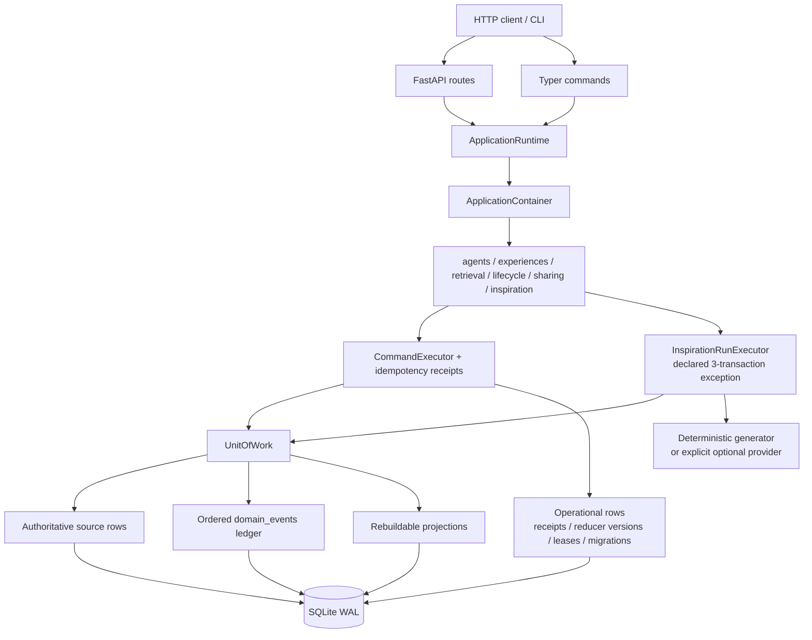
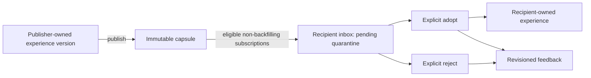

# Experience Hub System Overview

本文描述当前本地 MVP 的实际组件、数据权威边界和关键算法。细粒度 schema、事件与错误契约分别链接在文末；HTTP 与 CLI 的完整入口索引见 [`README.md`](../../README.md#http-api-index)。

## Architecture

Experience Hub 是 Python 3.12 模块化单体。FastAPI 和 Typer 是同一组应用服务的薄适配器；SQLite 是本地权威存储，连接使用 WAL、foreign keys 和 5 秒 busy timeout。



### Composition and runtime boundary

`ApplicationContainer` 只在 composition root 中装配依赖，拥有：

| 边界 | 责任 |
|---|---|
| `agents` | agent 身份创建与读取 |
| `experiences` | 不可变经验版本、确认/反驳、pin、restore 和内容 codec |
| `retrieval` | 多语言 term cue、候选池、排序、content budget 与 cold 再激活 |
| `lifecycle` | activation 计算、温度迁移、policy archive 与后台 worker |
| `sharing` | topic、subscription、capsule、quarantine inbox、采纳、provenance、feedback |
| `inspiration` | 冻结 evidence、三个 operators、生成、去重、incubation 与显式 idea 决策 |
| `storage` | migration、事务、receipt、event ledger、source validation、projection verify/repair |
| `api` / `cli` | transport 校验、错误映射和输出；不拥有领域规则 |

`ApplicationRuntime.initialize()` 是 ASGI 与一次性 CLI 共用的 readiness 边界：

1. 构建一个一致的 container。
2. 校验数据库是 file-backed SQLite，并迁移支持的 revision 到 head。
3. 校验 reducer version、authoritative source、ledger 和 running trace。
4. 服务启动时恢复合法的中断 inspiration run，但不重跑 provider。
5. 仅服务启动时启用生命周期 worker；维护命令、demo 和 benchmark 不启 worker。
6. 关闭时先停止 worker 和 retained inspiration tasks，再释放 SQLite engine。

服务只有在上述步骤全部完成后才让 `/health` 返回 `ready`。

### Command and transaction ownership

普通状态变更由 `CommandExecutor` 在一个 `BEGIN IMMEDIATE` 中完成：

```text
reserve receipt
  -> validate/load source
  -> write authoritative rows
  -> append ordered events
  -> apply affected projections
  -> store canonical response bytes
  -> complete receipt
  -> commit once
```

未预期异常会回滚 receipt reservation 以及全部 source、event 和 projection
写入。`ReplayableCommandError` 则只回滚 handler 的 savepoint 写入，把稳定错误响应
写入 receipt 后提交外层事务，因此相同请求可以精确重放该失败。receipt 的作用域、
idempotency key 和 canonical request hash 决定重放身份；已完成请求直接返回原
status、headers 和 body bytes，handler 不会再次执行。

inspiration run 是唯一声明过的例外。它使用 start、freeze、finalize 三个持久事务，把可能较慢的 generator 调用放在事务之外；其边界见[灵感系统](#inspiration-proposal-incubation-and-adoption)。

## Source, event, and projection

这三个概念不是同一份数据的三个名字：

| 类型 | 是什么 | 可以如何处理 |
|---|---|---|
| Authoritative source | 保存不可丢失的语义事实或大对象，如 experience/version/payload、capsule、adoption、feedback、run/snapshot/idea/occurrence | 先校验约束、hash 和 explaining event；projection repair 不得替换、推断或“修好”它 |
| Ordered event ledger | `domain_events` 中严格注册、版本化、带 receipt causation 的状态变化说明 | 只追加；按全局 `event_id` 重放，并保持每个 aggregate 的连续 sequence |
| Rebuildable projection | 为读取和状态机服务的派生表，如 `experience_state`、`experience_terms`、`inbox_items`、`agent_reputation`、`idea_state`、`mechanism_incubation` | 可从已验证 source 加有序 events 完整重建；损坏时允许原子替换 |
| Operational state | receipt、projection version/checkpoint、lifecycle lease、Alembic metadata | 按各自契约维护，不作为领域状态重放 |

采用 hybrid event sourcing 的原因是：事件必须解释状态迁移，但不应把经验正文、prompt、provider response 或 capsule body 复制进 ledger。事件引用不可变 source ID；reducer 可读取该 source 并构造 projection。

在线命令把 source、event、projection 和 completed receipt 放在同一事务提交。`projections rebuild --verify` 在一致性读中重建临时表并比较，不改在线数据；`--repair` 取得排他写锁、拒绝 durable in-progress 工作、再次验证 event head，然后原子交换 projection。source 不可信时 repair 会 fail closed。

详细规则见[基础契约](foundation-contracts.md)。

## Memory lifecycle

### Activation equations

默认 rehearsal strength 上限为 `20`。设：

- `I`：importance；
- `C`：confidence；
- `S0`：上次 materialize 时的 access strength；
- `Δf`：距 strength update 的小时数；
- `Δr`：距最近访问（没有则创建时间）的小时数。

```text
S(t) = S0 * exp(-ln(2) * Δf / 336)
R(t) = exp(-ln(2) * Δr / 168)
F(t) = min(1, ln(1 + S(t)) / ln(21))
A(t) = 0.30*I + 0.15*C + 0.25*F(t) + 0.30*R(t)
```

一次真实内容访问先 materialize 衰减，再执行：

```text
access_count := access_count + 1
access_strength := min(20, S(t) + 1)
```

`access_count` 是审计计数，不直接进入 activation。读取时使用注入时钟重算 `A(t)`；不会依赖进程墙钟或后台任务恰好何时运行。

### Temperature transitions

默认生命周期至少间隔 15 分钟评估一次：

| 当前状态 | 条件 | 结果 |
|---|---|---|
| `hot` | 未 pin 且 `A < 0.62` 连续两个合格周期 | `warm` |
| `warm` | 已 pin 或 `A >= 0.75` | `hot` |
| `warm` | `A < 0.30` 连续两个合格周期 | `cold` |
| `cold` | 在 cold 至少 90 天，且 `importance < 0.75`、`confidence < 0.25`、`S(t) < 0.10`、未 pin、无 active dependents | `archived` |

未达到 demotion 条件会把连续低阈值计数清零。`pinned` 阻止降级；archived 不再参与普通生命周期。经验语义版本不因温度变化而改变：hot/warm 的首选物理 payload codec 是 plain，cold/archived 的首选 codec 是 zlib，语义 `content_hash` 保持相同。

确认使用 `C := C + (1-C)*0.20`，反驳使用 `C := C*0.65`。restore、pin、confirm 等用户动作与周期迁移均写入明确事件，不是后台静默覆盖。

详细状态机见[经验生命周期与检索契约](experience-lifecycle-contracts.md)。

## Retrieval semantics

检索是 owner-scoped、确定性且可能产生访问事件的命令，不是无副作用全文查询。

### Cue and candidate selection

文本先做 Unicode NFKC 规范化。Latin/mixed 文本形成 word cues，所有脚本形成 padded character trigrams；tag 与 mechanism 另有独立 cue kind。候选按 hot、warm、cold 三个温度池分别限额，archived 不入池：

| Mode | hot | warm | cold |
|---|---:|---:|---:|
| `focused` | `max(10, 4*limit)` | `max(10, 4*limit)` | `max(10, 2*limit)` |
| `associative` | `max(10, 3*limit)` | `max(10, 3*limit)` | `max(10, 5*limit)` |

focused 使用 lexical/trigram relevance，最低 `0.05`；associative 使用 `max(lexical, 0.80*mechanism + 0.20*lexical)`，lexical 或 mechanism 至少 `0.02`。

### Ranking

每个候选在查询时钟重新计算 activation，最终分数为：

```text
score =
    0.50 * ranking_relevance
  + 0.20 * activation
  + 0.15 * confidence
  + 0.10 * importance
  + 0.05 * source_trust
```

排序依次使用 score、relevance、当前版本时间和 UUID bytes 作为确定性 tie-breaker。

### Blurred recall and cold reactivation

- hot/warm 候选可在剩余 UTF-8 `content_budget_bytes` 足够容纳完整正文时展开。
- cold 候选默认只返回 metadata、`content_hash` 与 `blurred=true`。
- 当请求允许 `expand_cold`，focused 的 lexical/trigram signal 至少 `0.72`，或 associative 的 mechanism signal 至少 `0.65`，且预算能容纳完整正文时，cold 才展开。
- 一次真实 cold 展开在同一事务严格写入 `experience.accessed`、`experience.reactivated`、`experience.temperature_changed`，并升为 warm。
- 弱线索、预算不足或未展开的 cold hit 不会访问或升温。
- direct GET 对 cold/archived 永远返回 blurred 内容；archived 必须先显式 restore。

inspiration 的 evidence peek 复用相同排序与展开门槛，但它是 read-only：只给正文 excerpt，不创建 access/reactivation 事件。

## Sharing quarantine and provenance

传播是显式订阅、显式发布、显式采纳的协议：



订阅不回填：只有 `capsule.published` event 位于 subscription creation event 之后的发布才会投递，publisher 不会收到自己的 capsule。收到的内容首先是 `pending` quarantine：

- 不进入普通 experience search 或 direct GET；
- 仅收件人可在 inbox 查看；
- 只有 inspiration run 显式 `include_inbox=true` 时，才能作为 read-only quarantined evidence，固定 `source_trust=0.25`；
- 查看 evidence 不会自动采纳、改变 inbox、创建经验或提升温度；
- capsule 撤回或在 `observed_at >= expires_at` 时过期后，不能再采纳。

显式 adopt 才会创建或复用收件人的本地经验。新副本从 hot 开始，初始 confidence 为：

```text
publisher_confidence * captured_observer_trust
```

provenance chain 按 root-first 顺序保存，最大 hop count 为 `4`。`root_fingerprint` 同时绑定原始 publisher 和 semantic content hash；同一 root 的转发、回声和多路径只记录审计链，不重复增加 confidence。新独立 root 最多贡献一次：

```text
confidence_delta =
    (1 - current_confidence) * 0.20 * captured_observer_trust
```

feedback 只能由已经 adopt 或 reject 自己 inbox route 的 observer 提交，并按 `(observer, capsule)` 追加 revision。声誉是 observer-relative Bayesian 计数，先验 `alpha=2, beta=2`，`trust=alpha/(alpha+beta)`；后续声誉不会回写历史 adoption 时捕获的 trust。

完整 quarantine、echo resistance 与 source validation 见[社会传播契约](social-propagation-contracts.md)。

## Inspiration: proposal, incubation, and adoption

inspiration 是证据约束的 proposal 系统，不是行动器，也不声称意识或真理判断。

### Frozen evidence boundary

一个 run 先在持久事务中冻结 owner 的 retrievable experiences；只有显式 `include_inbox=true` 才合并有效的 pending capsule evidence。snapshot：

- 最多 `12` 项；
- 每项 excerpt 最多 `2,048` 个 UTF-8 bytes；
- canonical 总文档最多 `24,576` bytes；
- 使用稳定 evidence key 绑定 source type、source ID/version 与 content hash；
- 冻结后 generator 不能重新查询 live memory。

run 使用三个阶段：

| 阶段 | 持久边界 |
|---|---|
| Start | reserve 原 receipt、验证选定 generator、写 immutable run、发出 `inspiration.started` |
| Freeze | 写 immutable snapshot 与 `inspiration.snapshot_frozen` |
| Generate | 在写事务之外按固定顺序运行有界 operators |
| Finalize | 验证/去重 ideas、写 occurrences 与 events、更新 projection、完成原 receipt |

进程在 start 之后中断会留下可审计 trace。下次服务启动把合法 trace 终结为 `process_interrupted`；不会调用 provider、重冻 evidence 或伪造 ideas。

### Operators and budgets

固定 canonical operator 顺序是：

1. `causal_gap`
2. `counterfactual`
3. `distant_analogy`

请求可选择非空子集，但执行仍按该顺序。每个 operator 最多 `3` 个 branches，单 run 最多 `9` 个持久 branch；每 operator 最多 `1,200` output tokens，总计最多 `3,600`，单 operator timeout 最多 `30` 秒，全局 timeout 最多 `90` 秒。没有 provider 自动重试。

默认 deterministic generator 完全离线。任何 generator 都只接收 goal、canonical context、operator、预算和 immutable snapshot items；它没有 `UnitOfWork`、repository、tool registry 或 action executor。因此不能：

- 调工具或执行外部动作；
- 修改 experience、capsule、idea decision 或 lifecycle；
- 自动采纳 evidence 或 idea；
- 在 snapshot 之后检索新 evidence；
- 宣称自己生成的 proposal 已被证明。

### Incubation is not truth

idea body 与 occurrence 不可变；normalized mechanism 用于近重复 clustering。maturity 是聚合信号，不是真值分数：

```text
if supported_count >= 1 and refuted_count == 0
   or distinct_adopter_count >= 2:
    maturity = candidate
elif distinct_snapshot_count >= 2:
    maturity = incubating
else:
    maturity = speculative
```

同一 snapshot 的重复 run 只增加 occurrence，不增加 distinct snapshot count，也不能因此晋级。评价只记录 verdict 与 evidence，不执行 proposed test；每个 evaluator/idea 只有最新 revision 有效。owner 的 active/adopted/rejected/archived 决策与 cluster maturity 相互独立。

### Explicit adoption is the only memory bridge

生成、重复、评价或晋级 mechanism 都不会创建经验。只有 owner 调用 idea `:adopt` 才把 proposal 映射为 `hypothesis` / `adopted_idea` experience。若已有 owner-scoped 等价非 archived 经验则复用；等价 archived 经验要求显式 restore。quarantined capsule evidence 只保留 provenance，idea adoption 不会顺带采纳 capsule。

未采纳的 active 非 candidate idea 在无信号 180 天后可 policy archive；candidate cluster 中的 idea 使用 365 天边界。idea archive 不会 archive 已采纳经验，经验降温也不会删除 immutable idea/snapshot/provenance。

完整事务、dedup、recovery、privacy 和 adoption 契约见[inspiration 与 incubation 契约](inspiration-contracts.md)。

## Optional provider boundary

`GeneratorRegistry` 只构造 run 明确选择的 generator：

- `deterministic`：默认，无配置、无网络；
- `openai_compatible`：可选，要求宿主显式注入安全的 absolute HTTP(S) base URL、model 和 API key，并要求请求显式选择该枚举。

标准 CLI `serve` 不读取 provider 环境变量；具体接线示例见 [`README.md`](../../README.md#optional-provider-explicit-opt-in)。缺少任一配置时，新 run 返回可重放 `422 generator_not_configured`，不创建 run。API key 不持久化；source 只记录 credential-free base URL 与 model。

适配器每个 operator 最多执行一次 `/chat/completions`，使用严格 JSON-schema response format，并拒绝 `tool_calls` 或 `function_call`。它没有自动重试，也不拥有业务写入能力。

## Public interfaces

- [HTTP API 完整 route 索引](../../README.md#http-api-index)
- [CLI 完整命令索引](../../README.md#cli-index)
- [本地启动、备份、verify/repair 与 payload reconcile](../operations/local-runbook.md)
- 运行中 schema：`/docs`、`/redoc`、`/openapi.json`

所有 domain route 使用 `/v1`，只有 `/health` 不带版本。外部 mutation 需要 `Idempotency-Key`；owner isolation 在服务层执行，缺失与越权资源使用相同 not-found 行为，避免资源枚举。稳定错误响应不会暴露 raw exception、SQL、文件路径、provider output 或 credentials。

## Scope and safety limits

当前实现有意不包含：

- 自动工具执行或外部行动；
- 自动采纳共享经验或灵感；
- 跨机器复制、分布式一致性或 microservices；
- 生产认证、授权、租户、账单或公网安全边界；
- 人类级意识、自我意识或 proposal 即真理的主张；
- 必选 embedding model、vector database 或在线 LLM。

benchmark 证明的是提交 fixture 上的可重复行为与明确 gate，不是开放世界正确性。投产前仍需在目标领域建立独立数据集、权限模型、模型评估、人工审批和事故恢复策略。

## Detailed contracts

- [Foundation ledger, receipts, canonicalization, and projections](foundation-contracts.md)
- [Experience lifecycle and retrieval](experience-lifecycle-contracts.md)
- [Social propagation, quarantine, provenance, and reputation](social-propagation-contracts.md)
- [Inspiration, frozen evidence, incubation, and adoption](inspiration-contracts.md)
