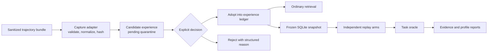

# RFC: Experience Replay Lab

- Status: capture and isolated replay foundation implemented; research cycle planned
- Date: 2026-07-22
- Audience: agent-framework and coding-agent developers
- Scope: local-first capture, quarantine, adoption, and isolated replay

## Summary

Experience Replay Lab extends Experience Hub from a local experience ledger into
a developer tool for inspecting and testing what an agent learned. It captures a
sanitized trajectory bundle, derives candidate experiences, keeps every candidate
quarantined until an explicit decision, and compares memory policies in isolated
replay databases created from the same frozen snapshot.

The product category is **experience engineering** rather than general-purpose
agent memory:

> Record what an agent learned, decide whether to trust it, and replay its effect
> before allowing it to shape future work.

The default path remains offline, deterministic, owner-scoped, and free of model
keys. Model-assisted extraction stays an explicit optional adapter.

## Motivation

Most memory systems optimize storing and retrieving information. That leaves four
questions unanswered:

1. Which reusable procedure or constraint did the agent infer from a trajectory?
2. Why is that candidate allowed to influence future tasks?
3. Did adopting it improve task outcomes or introduce negative transfer?
4. Can the result be reproduced without changing the live experience database?

Experience Hub already provides the useful foundation: immutable sources and
events, rebuildable projections, owner isolation, idempotent commands, explicit
capsule and idea adoption, deterministic benchmark fixtures, and isolated SQLite
replay. This RFC adds capture and experiment boundaries without weakening those
contracts.

## Goals

- Accept a strict, versioned trajectory bundle through pluggable adapters.
- Derive immutable, owner-scoped candidate experiences with complete lineage.
- Prevent pending candidates from ordinary retrieval, sharing, and inspiration.
- Require an explicit, idempotent adopt or reject decision.
- Run baseline and Experience Hub policies from byte-identical SQLite snapshots.
- Produce sanitized, reproducible result bundles with per-case evidence.
- Keep technical validation possible for a solo maintainer without external
  participants.
- Make a five-minute, offline developer demonstration the primary public entry
  point.

## Non-goals

- A general agent runtime, trace-observability platform, or web dashboard.
- Autonomous tool execution or automatic candidate adoption.
- Production authentication, tenant administration, or public-network safety.
- Cross-machine replication, distributed consensus, or implicit synchronization.
- Persisting full prompts, credentials, raw provider responses, or arbitrary tool
  output by default.
- Claiming that a fixed benchmark proves intelligence, truth, creativity, or
  universal task improvement.

## Product flow



Capture and replay are different trust boundaries. Capture may add quarantined
source records to the live database. Replay only reads a closed snapshot and
writes to isolated clones and report artifacts. Replay never writes results back
to the live database.

## Architecture

### Capture boundary

The new `capture` package owns the input protocol, adapters, normalization, and
candidate-extraction interface. It does not own adoption or normal retrieval.

`TrajectoryBundleV1` is a strict canonical document containing:

- schema version and adapter descriptor;
- owner identity;
- stable trajectory and step identifiers;
- ordered observations, actions, outcomes, and typed evidence references;
- source timestamps supplied by the adapter;
- a declared sanitization profile;
- a canonical manifest hash.

Inputs must be sanitized before capture. Configured secret scanners are
defense-in-depth: a match rejects the bundle, but a clean scan is not represented
as proof that arbitrary input contains no sensitive information. The default
capture path persists the manifest, hashes, bounded evidence excerpts, and
candidate content rather than the complete raw trajectory.

The first release supports a generic JSONL adapter and a committed coding-agent
fixture. A second product-specific adapter is added only after the generic
contract has survived real use.

The default extractor is deterministic. An optional model extractor receives
only the frozen, bounded, sanitized input selected for that run. It has no unit
of work, repository, tool registry, or action executor.

### Candidate experience boundary

Candidate experience source and state remain within the `experiences` domain.
Candidate, capsule, and idea are separate models; the first release does not add
a generic adoptable-resource framework.

An immutable candidate records:

- candidate, owner, and source-bundle identities;
- source manifest and content hashes;
- kind and proposed `VersionContent`;
- ordered evidence references;
- extractor kind and credential-free configuration identity;
- creation time from the injected clock.

Its rebuildable state is `pending`, `adopted`, or `rejected`. Pending candidates
are excluded from experience queries, retrieval indexes, sharing publication,
and inspiration evidence. Adopt and reject are explicit idempotent commands.

Adoption creates or reuses one owner-scoped experience using the existing content
uniqueness rules. It preserves candidate and trajectory lineage and does not
rewrite the candidate body. Rejection retains the immutable candidate and a
structured reason. Repeated or conflicting decisions fail closed.

### Experiment boundary

The new `experiments` package owns replay manifests, snapshot cloning, policy
arms, task oracles, metrics, and report validation. It depends on public
application-service interfaces and storage snapshot utilities; product domains
do not depend on `experiments`.

Every experiment pins:

- dataset and case-manifest hashes;
- a closed, checkpointed SQLite snapshot hash;
- injected clock and deterministic ID strategy;
- ordered policy-arm descriptors;
- task-oracle version;
- seed and optional credential-free model identity;
- metric and profiler schema versions.

Each arm receives its own database clone. The implemented smoke arms are
`no_memory` and `experience_hub`; recent notes and SQLite FTS5/BM25 remain
planned August baselines. Failed required arms cannot contribute to an effect
comparison. Infrastructure failures are recorded without changing other clones.

Canonical evidence reports exclude wall duration, machine paths, credentials,
raw UUIDs, and unstable runtime fields. Performance measurements such as latency,
storage, and token use live in a separate `profile.json`; they never participate
in byte-identical replay comparison.

### Public surface

The first release is CLI-first and reuses application services. It needs flows
for:

- inspecting and validating a bundle without persistence;
- capturing a bundle into pending candidates;
- listing, inspecting, adopting, and rejecting owned candidates;
- running a committed replay suite;
- validating and comparing result bundles.

New HTTP routes are deferred until the command and report contracts are stable.
There is no web frontend in this RFC.

### Implementation decomposition

This document is an umbrella product RFC, not one indivisible implementation
batch. Delivery is split into two sequential subprojects:

1. **Capture and candidate quarantine** defines the bundle, generic adapter,
   immutable candidate, explicit decisions, lineage, and CLI flows.
2. **Isolated replay lab** defines snapshots, policy arms, task oracles, reports,
   profiler artifacts, and ExperienceBench-S.

Both foundation subprojects are implemented: Generic JSONL capture with candidate
quarantine, and the CLI-only two-arm isolated replay runner with canonical
evidence. ExperienceBench-S, additional baselines, adversarial expansion and the
research report remain separate planned work for the August experiment cycle.

## Trust and failure semantics

The feature follows existing stable domain errors and canonical responses.

- Invalid schema, ambiguous owner, hash mismatch, unsupported adapter, or a
  configured sensitive-data match causes no domain mutation.
- Extractor failure produces no partial candidate. Sanitized run failure may be
  retained for audit without provider output.
- Foreign-owned and missing candidates are indistinguishable to the caller.
- Replaying a snapshot with uncheckpointed side files, invalid ownership marker,
  unsupported schema, or failed source validation aborts before cloning.
- A failed infrastructure arm makes the comparison incomplete; the report cannot
  silently omit it or compute a favorable effect from the remaining arms.
- Owner leakage, quarantine bypass, live-database mutation, projection mismatch,
  or replay divergence is a safety failure and blocks release.

## Validation

### Existing smoke suite

The committed 15-case benchmark remains a release regression suite. Its focused
retrieval, cold recall, propagation, inspiration, and byte-replay gates are useful
engineering evidence, not an open-world effectiveness claim.

The committed Replay Lab smoke adds two synthetic retrieval cases. It exercises
closed-source validation, independent clones, incomplete-report rejection and
byte-identical evidence. It proves isolation, report validation and repeatability
only; it is not ExperienceBench-S, a human study, or evidence of general
effectiveness.

### ExperienceBench-S

Research experiments begin in August 2026. The first suite contains at least 100
paired coding-agent tasks covering recurring workflows, environment-specific
gotchas, state changes, failure recovery, irrelevant distractors, and Chinese,
English, and mixed-language evidence.

For the same case, snapshot, clock, and seed, the primary technical outcome is:

```text
delta_utility = score_experience_hub - score_strongest_baseline
```

The pilot direction continues only when the point estimate improves by at least
five percentage points. A general effectiveness claim additionally requires a
paired 95% confidence interval whose lower bound is above zero and no principal
task stratum more than two percentage points worse than the strongest baseline.

### Experience Firewall adversarial suite

The first adversarial suite contains at least 300 owner-sharded cases covering
foreign access, pending leakage, malicious candidates, repeated roots, echo,
expiry, retraction, forged provenance, and content-hash collisions. Zero observed
owner or quarantine leaks is required. The suite expands to at least 1,000 cases
before a general safety comparison is published.

### No-participant path

External participants are not a release gate. Evidence maturity is reported as:

- `R0`: maintainer and clean-room CI reproduction;
- `R1`: one independent external result bundle;
- `R2`: three independent external reproductions;
- `R3`: at least five reproductions plus an external adapter or benchmark case.

Assisted sessions are labeled separately and never counted as independent. The
project may publish at R0 with an explicit disclosure.

## Success measures

The primary technical measure is paired task utility. Release guardrails are zero
owner leakage, zero quarantine bypass, unchanged live database state, and
byte-identical deterministic replay.

Developer usability is first assessed by clean-room automation. Small human
sessions are descriptive: they report completion count, time, and blockers rather
than unsupported population percentages.

GitHub stars, visitors, clones, forks, and external contributions are reach and
adoption diagnostics, not evidence of technical correctness. The public project
does not promise star counts. External reproduction level and accepted adapters
are stronger adoption signals.

## Delivery sequence

### Implemented foundation in July 2026

- Strict bundle, candidate, replay-manifest and result-bundle contracts.
- Generic JSONL adapter, deterministic extractor and committed capture fixture.
- Pending candidate quarantine with explicit owner-scoped adoption or rejection.
- Closed SQLite snapshots, marker-owned workspaces, independent replay clones,
  two required smoke arms and separate canonical evidence/profile artifacts.
- CLI inspect/run/verify flow, public contracts and clean-room package checks.
- Sensitive-content, private-path and raw-UUID checks for replay output.

Public release remains blocked until the maintainer deliberately selects a
license. This RFC does not select or change the project license.

### August 2026: first experiment cycle

- Week 1: add recent-notes and SQLite FTS5/BM25 baselines to the implemented
  isolated runner.
- Week 2: run the planned 100-case ExperienceBench-S pilot.
- Week 3: run and expand the planned Experience Firewall adversarial suite.
- Week 4: publish a research report from the pilot plus its profiler artifact.

No external participant count blocks this cycle.

### Two to six months: firewall and adapters

- Add one or two demonstrated coding-agent adapters.
- Stabilize candidate and capsule inspection, decision, and lineage surfaces.
- Expand to at least 800 paired tasks and 1,000 adversarial cases.
- Publish monthly evidence-bearing releases rather than frequent cosmetic ones.
- Open narrow contribution paths for adapters, benchmark cases, reproduction,
  and documentation.

### Six to eighteen months: protocol and hypothesis testing

- Design versioned, signed, portable experience capsules.
- Add counterfactual contribution analysis for individual experiences.
- Extend Hypothesis Foundry with prospective tests and independent evidence.
- Explore an optional Experience Mesh only after real multi-user demand appears;
  local-first and explicit adoption remain the defaults.
- Seek independent reproduction and a public technical report or benchmark
  submission without making either a prerequisite for maintaining the core.

## Testing strategy

- Unit tests cover bundle canonicalization, adapter normalization, candidate state
  rules, manifest hashing, arm validation, metrics, and report validation.
- Repository tests cover immutable sources, event ordering, adoption atomicity,
  owner isolation, idempotency, projection rebuild, and failure rollback.
- Contract tests pin the generic adapter, trajectory bundle, candidate response,
  experiment manifest, canonical report, and profiler schemas.
- Application-service and CLI tests cover stable errors, partial experiment
  failure, and no raw input or provider output in responses.
- End-to-end tests prove pending invisibility, adopted lineage, independent arm
  clones, unchanged live state, and byte-identical replay.
- Release validation continues to run the repository's complete lock, lint, type,
  test, demo, benchmark, and build commands.

## Acceptance criteria

The implemented foundation satisfies:

- a generic fixture produces an immutable candidate with valid source lineage;
- the candidate is absent from retrieval, sharing, and inspiration while pending;
- adopt and reject are owner-scoped, idempotent, atomic, and replayable;
- adoption creates or reuses one experience without losing candidate lineage;
- every replay arm starts from the same frozen database bytes in an independent
  clone;
- an experiment cannot modify the live database or its projections;
- repeated deterministic runs produce byte-identical canonical reports;
- incomplete or unsafe experiments cannot yield a passing effectiveness report;
- public documentation describes current evidence and limitations without
  presenting planned research as shipped behavior.

Before every release candidate or delivery, maintainers must freshly run and
review the complete lock, lint, type, test, demo, benchmark, and build acceptance
gates. This RFC defines that recurring gate; it does not record one local pass as
a permanent property of the implementation.

Cross-platform clean-room release evidence, the 100-case pilot, stronger
baselines, adversarial expansion, independent reproduction and the public
research report are planned acceptance work, not shipped results. Public release
also remains blocked by the missing maintainer-selected license.

## Publication principle

The public story is short: capture, quarantine, adopt, replay, compare. Detailed
execution notes remain outside public release artifacts. Community growth is
earned through reproducible results, useful adapters, and honest limitations,
not account sharing, inflated participation, or unsupported performance claims.
